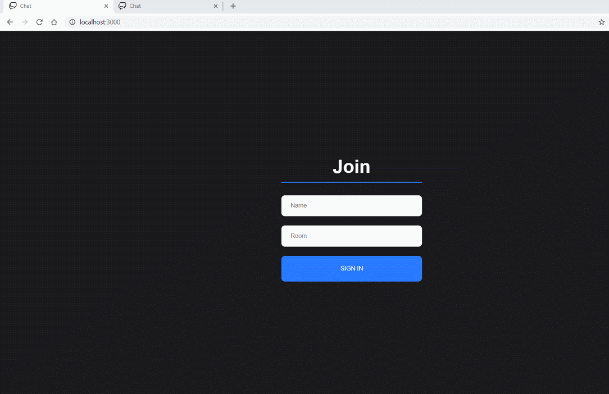

<h1 align="center">Chat-App</h1>

 
   

  

<h2>📖 Sobre</h2>

 Exemplo simples de Chat.

------------

<h2>🚀 Tecnologias</h2>

Este projeto foi desenvolvido com as seguintes tecnologias:
- [NodeJs](https://nodejs.org/en/ "NodeJs")
- [Socket.io](https://socket.io// "Socket.io")
- [React](https://reactjs.org/ "React")

------------

<h3>Dependências</h3>

- [Express](https://expressjs.com/ "Express")

------------

<h2>♻️ Como Contribuir</h2>

- Fork este repositório;

- Crie uma branch com a sua feature: `git checkout -b my-feature`

- Commit suas mudanças: `git commit -m 'feat: My new feature'`

- Push a sua branch: `git push origin my-feature`

------------

<h2>🎓 Quem ministrou?</h2>
Foi ministrado pelo <a href="https://github.com/adrianhajdin">Adrian Hajdin</a> do <a href="https://www.buymeacoffee.com/JSMastery">Javascript Mastery.

------------

<h2>📃Licença</h2>

Este projeto está sobre a Licença do MIT. Acesse a <a href="https://github.com/Nandosbx/Chat-App/blob/master/LICENSE.md">Licença</a> e saiba mais.

------------

<footer align="center">
 <strong align="center">Made with 💜 by Fernando Batista</strong>
</footer>